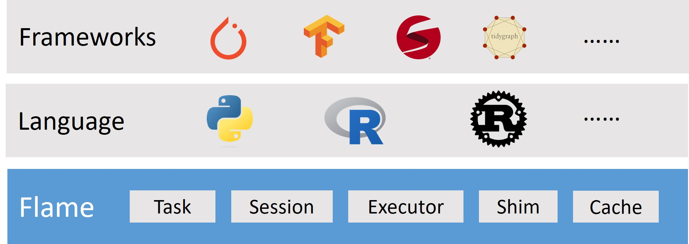

# Flame: A Distributed System for Intelligent Workload

Flame is a distributed system for intelligent workloads; it provides a suite of mechanisms that are commonly required by many classes of intelligent workload, 
including AI/ML, VaR, Transcoding, BlockChain and so on. Flame builds upon a decade and a half of experience running a wide variety of high performance workloads
at scale using several systems and platforms, combined with best-of-breed ideas and practices from the open source community.

## Motivation

Most high performance workload can be classified into batch workload and elastic workload; currently, Kubernetes/Slurm/PBS supports batch workload well by
several features, e.g. fair-sharing, but there's still some gaps for elastic workload:

* **Start time**: Usually, there are millions of tasks per job, and the task execution time is short, e.g. seconds. Meanwhile, it'll take seconds to start a new Pod in resource manager (e.g. Kubernetes).
  That means we'll spend half of time on starting Pods if one task per Pod.

* **Data reuse**: Tasks in the job may reuse data to speed up the execution, especially the data was got by heavy operator/call, e.g. Database connection.
  It's hard for tasks to reuse such kind of data in different Pods.

## Overall Architecture

### Terminologies

**Session:** One `Session` represents one elastic job, the `Session Scheduler` will allocate resources to each session based on scheduling configurations, by asking for resource manager (e.g. Kubernetes) to create pods

**Task:** The task of `Session` (elastic job), it includes task metadata and input/output info, e.g. volume path

**Client:** The user's code to create session, submit tasks and retrieve task output if necessary

**Application/Service:** The user's code to execute tasks in a Pods; usually, the service instances are not reused between session, but the image maybe reused

**Executor:** The manager of application/service, who will handle the lifecycle management of Application/Service.

### Functionality

The Flame will accept connection from user's client, and create `Session`s for each elastic job; the client keeps submit tasks to the session until closing it, pre-defined replica is not necessary.
The `Session Scheduler` will allocate resources to each session based on scheduling configurations, by asking for resource manager (e.g. Kubernetes) to create pods. The Executor in the Pod will connect back to Flame by `gRPC` to
pull tasks from related `Session` to avoid Pods creation. The Pods will be released/deleted if no more tasks in related session.

The service will get the notification when it's bound or unbound to the related session, so it can take action accordingly, e.g. connecting to database; and then, the service can pull tasks from `Session`,
and reuse those data to speed up execution.

In the future, the `Session scheduler` will provide several features to improve the performance and usage, e.g. proportion, delay release, min/max and so on.

## Quick Start Guide

TBD

## Reference

* **API**: https://github.com/xflops/flame/blob/main/rpc/protos/flame.proto

